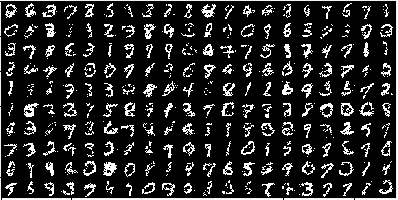

# CS236-HW2

1. `codebase/utils.py`
1. `codebase/models/vae.py`: Variational auto-encoder to learn a probabilistic model of the MNIST dataset. Prior is a univariate Gaussian with zero mean and std = 1



1. `codebase/models/gmvae.py`: Variational auto-encoder to learn a probabilistic model of the MNIST dataset. Prior is a mixture of Gaussian for more expressive capability of VAE


1. `codebase/models/ssvae.py`
1. `codebase/models/fsvae.py` (bonus)


The models can take a while to run on CPU, so please prepare accordingly. On a
2018 Macbook Pro, it takes ~7 minutes each to run `vae.py` and `gmvae.py`. It
takes ~50 minutes to run `ssvae.py`. It will take a very long time to run
`fsvae.py` to completion; we recommend stopping training the moment your samples
look somewhat decent (maybe around `50000` iterations). Note that we periodically
save models for you.

1. `codebase.utils.load_model_by_name` (for loading a model. See example usage in `run_vae.py`)
1. The sampling functionalities in `vae.py`/`gmvae.py`/`ssvae.py`/`fsvae.py`
1. `numpy.swapaxes` and/or `torch.permute` (for tiling images when represented as numpy arrays)
1. `matplotlib.pyplot.imshow` (for generating an image from numpy array)

---

### Dependencies

This code was built and tested using the following libraries

```
numpy==1.17.0
torchvision==0.4.1a0+d94043a
torch==1.3.0
tqdm==4.34.0
```

---

