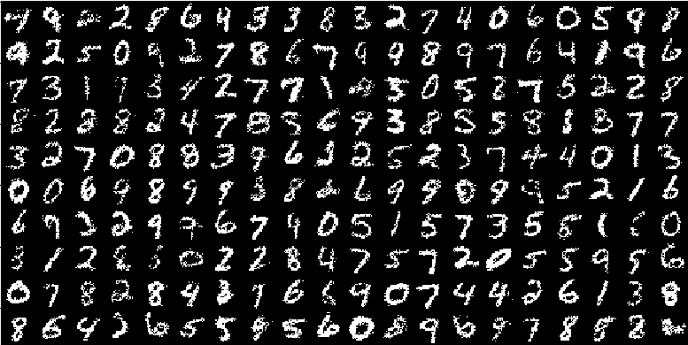

# CS236-HW2

1. `codebase/utils.py`
2. `codebase/models/vae.py`: Variational auto-encoder to learn a probabilistic model of the MNIST dataset. Prior is a univariate Gaussian with zero mean and std = 1


3. `codebase/models/gmvae.py`: Variational auto-encoder to learn a probabilistic model of the MNIST dataset. Prior is a mixture of Gaussian for more expressive capability of VAE. One can see from the image generated by the prior of mixture of Gaussians is better than a single univariate Gaussian prior.



4. `codebase/models/ssvae.py`: Semi-supervised VAE.  We have 100 samples where the digits are known and for the rest of the samples the digit labels are unknown. We are interested in building a classifier that predicts the digit given the sample x. However, we would like to leverage the large amount of unlabeled data that we have to improve our classifier’s performance.

Classification accuracy when using only the small labeled dataset: ~73%
Classification accuracy when using only the small labeled dataset and the unlabeled dataset: ~93%

5. `codebase/models/fsvae.py` Fully supervised VAE for style and content disentanglement on SVHN dataset.

The models can take a while to run on CPU, so please prepare accordingly. On a
2018 Macbook Pro, it takes ~7 minutes each to run `vae.py` and `gmvae.py`. It
takes ~50 minutes to run `ssvae.py`. It will take a very long time to run
`fsvae.py` to completion; we recommend stopping training the moment your samples
look somewhat decent (maybe around `50000` iterations). 

1. `codebase.utils.load_model_by_name` (for loading a model. See example usage in `run_vae.py`)
1. The sampling functionalities in `vae.py`/`gmvae.py`/`ssvae.py`/`fsvae.py`
1. `numpy.swapaxes` and/or `torch.permute` (for tiling images when represented as numpy arrays)
1. `matplotlib.pyplot.imshow` (for generating an image from numpy array)

---

### Dependencies

This code was built and tested using the following libraries

```
numpy==1.17.0
torchvision==0.4.1a0+d94043a
torch==1.3.0
tqdm==4.34.0
```

---

